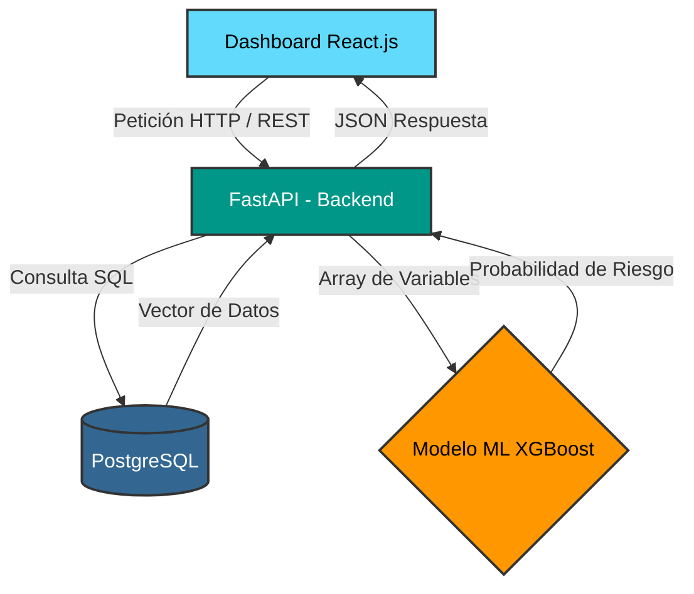

# Documento Técnico: Arquitectura y Base de Datos

## Capítulo 1: Diseño de Base de Datos (PostgreSQL)

Para capturar de forma precisa el ciclo de vida laboral de los colaboradores y proveer información histórica confiable al Motor Predictivo, se ha diseñado una base de datos relacional transaccional (OLTP) en PostgreSQL[cite: 1]. 

El esquema está compuesto por 8 tablas diseñadas hasta la Tercera Forma Normal (3NF), separando la información estandarizada, los datos fijos del empleado y su historial de comportamiento.

### 1.1 Tablas de Catálogo (Estandarización)
Estas tablas evitan la redundancia y aseguran que los datos ingresados por el equipo de Recursos Humanos estén estandarizados, lo cual es vital para el correcto funcionamiento del modelo de Machine Learning.

| Tabla | Columnas Clave | Descripción |
| :--- | :--- | :--- |
| `cat_departamentos` | `id` (PK)<br>`nombre`<br>`presupuesto_anual` | Estructura organizativa y áreas de la empresa. |
| `cat_puestos` | `id` (PK)<br>`titulo`<br>`rango_salarial_min`<br>`rango_salarial_max` | Define los roles y límites salariales para detectar posibles brechas de compensación. |

### 1.2 Tabla Núcleo (Datos Estáticos)
Almacena el perfil demográfico y contractual del empleado. Esta tabla centraliza las relaciones (Llaves Foráneas) hacia los catálogos y el historial transaccional.

| Tabla | Columnas Clave | Descripción |
| :--- | :--- | :--- |
| `empleados` | `id` (PK, UUID)<br>`puesto_id` (FK)<br>`departamento_id` (FK)<br>`fecha_contratacion`<br>`distancia_oficina_km`<br>`estado_activo` (Boolean) | Información base del colaborador. La variable `estado_activo` indicará históricamente si el empleado ya rotó o sigue en la empresa. |

### 1.3 Tablas Transaccionales (Históricos de Comportamiento)
En lugar de sobrescribir datos, el sistema registra cada evento en el tiempo. Estos historiales permiten que el algoritmo predictivo detecte tendencias (ej. "meses sin recibir un aumento salarial" o "caída repentina en el desempeño").

| Tabla | Columnas Clave | Descripción |
| :--- | :--- | :--- |
| `historial_salarios` | `id` (PK)<br>`empleado_id` (FK)<br>`monto_mensual`<br>`fecha_cambio`<br>`motivo` | Rastrea la curva salarial del colaborador a lo largo del tiempo. |
| `evaluaciones_desempeno` | `id` (PK)<br>`empleado_id` (FK)<br>`fecha_evaluacion`<br>`puntuacion_kpi`<br>`cumplimiento_metas` | Registro de calificaciones periódicas asignadas por los líderes. |
| `encuestas_clima` | `id` (PK)<br>`empleado_id` (FK)<br>`fecha_encuesta`<br>`satisfaccion_liderazgo`<br>`balance_vida_trabajo` | Resultados históricos de encuestas de satisfacción laboral. |
| `capacitaciones` | `id` (PK)<br>`empleado_id` (FK)<br>`nombre_curso`<br>`horas_invertidas`<br>`fecha_termino` | Registro de formación continua del empleado. |
| `registro_ausentismos` | `id` (PK)<br>`empleado_id` (FK)<br>`fecha_falta`<br>`motivo_justificado` (Boolean) | Control granular de ausencias. Picos de ausentismo injustificado son fuertes predictores de abandono. |

### 1.4 Integración con Machine Learning (Vista Materializada)
Para evitar que el modelo predictivo realice consultas relacionales complejas (`JOINs` múltiples) que degraden el rendimiento en tiempo de ejecución, la base de datos implementará una **Vista Materializada (Materialized View)** en PostgreSQL[cite: 1]. 

Esta vista se actualizará periódicamente y se encargará de aplanar y calcular métricas consolidadas por empleado (ej. *salario_actual*, *meses_desde_ultimo_aumento*, *promedio_desempeno_anual*, *total_ausencias_semestre*), entregando un vector de características (Feature Vector) optimizado y listo para la ingesta directa del modelo de Inteligencia Artificial.

## Capítulo 2: Arquitectura de Software e Integración

### 2.1 Patrón Arquitectónico
El Proyecto de Desarrollo de un Motor Predictivo de Rotación de Personal[cite: 1] operará bajo una arquitectura **Cliente-Servidor API-First**. Este enfoque separa completamente la interfaz de usuario (Frontend) de la lógica de negocio y procesamiento de datos (Backend), permitiendo que los modelos de aprendizaje automático[cite: 1] se ejecuten de forma aislada y segura en el servidor.

El sistema se compone de cuatro capas lógicas:

*   **Capa de Presentación (Frontend - React.js[cite: 1]):**
    *   Es una Single Page Application (SPA) responsable de renderizar el Dashboard interactivo, las tablas de empleados y las gráficas de riesgo.
    *   Gestiona el estado de la aplicación y almacena de forma segura el token JWT para mantener la sesión activa del usuario.
*   **Capa Lógica y de Orquestación (Backend - Python y FastAPI[cite: 1]):**
    *   Actúa como el cerebro del sistema. Recibe las peticiones HTTP (GET, POST, PUT, DELETE) desde la interfaz en React.
    *   Contiene los controladores que validan permisos (Autenticación JWT) y gestionan el acceso a la base de datos relacional.
*   **Capa Analítica (Machine Learning - Scikit-learn y XGBoost[cite: 1]):**
    *   Un módulo analítico cargado en memoria por FastAPI al iniciar el servidor (archivo `.pkl` o `.joblib`).
    *   Recibe los vectores de datos consolidados del empleado y retorna la estimación del riesgo de rotación[cite: 1].
*   **Capa de Persistencia de Datos (PostgreSQL[cite: 1]):**
    *   Almacena las tablas relacionales con el historial transaccional de la plantilla laboral.
    *   Utiliza una **Vista Materializada (Materialized View)** que pre-calcula y aplana la información para entregarla rápidamente al modelo predictivo sin saturar el procesador con operaciones relacionales complejas en tiempo de ejecución.

### 2.2 Diagrama de Flujo de Datos (Inferencia)
El ciclo de vida para generar alertas tempranas y recomendaciones[cite: 1] sigue esta secuencia exacta:

1. El usuario selecciona a un empleado en el panel de React y solicita una evaluación de riesgo.
2. React envía una petición HTTP REST hacia FastAPI.
3. FastAPI consulta la Vista Materializada en PostgreSQL para obtener el historial consolidado del empleado.
4. PostgreSQL devuelve un vector de características plano (ej. `[salario, ausentismo, desempeño, meses_antiguedad]`).
5. FastAPI inyecta este vector en el modelo preentrenado de Scikit-learn/XGBoost.
6. El modelo procesa la información y devuelve la estimación de riesgo.
7. FastAPI formatea el resultado en un JSON y lo responde a React.
8. React actualiza la interfaz mostrando una alerta (Verde, Amarilla o Roja) según el porcentaje obtenido.

### 2.3 Representación Visual (Diagrama)
*(Nota: El siguiente bloque genera un diagrama automático si tu editor soporta Mermaid.js, como GitHub, GitLab o Notion).*


## Capítulo 3: Especificación de Rutas y Endpoints de la API

La API REST del Motor Predictivo se diseñó bajo las convenciones estándar del protocolo HTTP, versionado de URL (`/api/v1`) y respuestas en formato JSON. Todas las rutas protegidas requieren el envío de un encabezado de autorización HTTP con el esquema Bearer: `Authorization: Bearer <token_jwt>`.

### 3.1 Módulo de Autenticación (`/api/v1/auth`)

Gestiona el inicio de sesión del personal de Recursos Humanos y la emisión de tokens de acceso seguro para interactuar con la plataforma.

#### `POST /api/v1/auth/login`
* **Descripción:** Autentica a un usuario del sistema y devuelve un token de acceso JWT.
* **Autenticación:** Pública (sin token).
* **Cuerpo de la petición (JSON):**
  ```json
  {
    "correo": "analista.rh@plurione.com",
    "password": "PasswordSegura123!"
  }

{
  "access_token": "eyJhbGciOiJIUzI1NiIsInR5cCI6IkpXVCJ9...",
  "token_type": "bearer",
  "expires_in": 28800
}

### 3.2 Módulo de Gestión de Empleados (`/api/v1/empleados`)

Controla las operaciones CRUD (Crear, Leer, Actualizar, Eliminar) sobre los colaboradores registrados en la base de datos PostgreSQL, sirviendo como la fuente de verdad principal para el panel de Recursos Humanos.

#### `GET /api/v1/empleados`
* **Descripción:** Obtiene un listado paginado de la plantilla laboral, permitiendo aplicar filtros por departamento o estatus de actividad.
* **Autenticación:** Requerida (JWT).
* **Parámetros de consulta (Query Params):**
  * `pagina` (int, default=1): Número de página para la paginación.
  * `limite` (int, default=20): Cantidad de registros por página.
  * `departamento_id` (int, opcional): ID para filtrar por un área específica.
* **Códigos de respuesta:** `200 OK`.
* **Ejemplo de respuesta (200 OK):**
  ```json
  {
    "total": 1250,
    "pagina": 1,
    "limite": 20,
    "datos": [
      {
        "id": "b3c8f870-1e5b-4c22-9214-7226f98ef4a1",
        "puesto": "Desarrollador Backend",
        "departamento": "Tecnología",
        "salario_actual": 28500.00,
        "antiguedad_meses": 18,
        "estado_activo": true
      }
    ]
  }

{
  "puesto_id": 3,
  "departamento_id": 2,
  "distancia_oficina_km": 14,
  "salario_inicial": 25000.00,
  "fecha_contratacion": "2026-09-23"
}

### 3.3 Módulo de Métricas Transaccionales (`/api/v1/registros`)

Permite alimentar las tablas históricas para mantener al día el comportamiento del empleado y asegurar que el modelo predictivo evalúe el riesgo con la información más reciente.

#### `POST /api/v1/registros/evaluacion`
* **Descripción:** Registra una nueva evaluación de desempeño periódica (KPIs) para un empleado en la base de datos.
* **Autenticación:** Requerida (JWT).
* **Cuerpo de la petición (JSON):**
  ```json
  {
    "empleado_id": "b3c8f870-1e5b-4c22-9214-7226f98ef4a1",
    "puntuacion_kpi": 82,
    "cumplimiento_metas": 85.5,
    "fecha_evaluacion": "2026-09-24"
  }

{
  "empleado_id": "b3c8f870-1e5b-4c22-9214-7226f98ef4a1",
  "fecha_falta": "2026-09-24",
  "motivo_justificado": false
}

### 3.4 Módulo del Motor Predictivo (`/api/v1/predicciones`)

El núcleo de Inteligencia Artificial del sistema. Conecta la información consolidada extraída de la Vista Materializada con el modelo preentrenado (XGBoost / Scikit-learn) para la estimación de riesgo.

#### `GET /api/v1/predicciones/empleado/{empleado_id}`
* **Descripción:** Ejecuta la inferencia del modelo en tiempo real para un empleado registrado. Extrae las variables desde PostgreSQL y calcula la probabilidad estadística de que el colaborador abandone la empresa.
* **Autenticación:** Requerida (JWT).
* **Códigos de respuesta:** 
  * `200 OK`: Predicción generada exitosamente.
  * `404 Not Found`: El ID del empleado no existe.
* **Ejemplo de respuesta (200 OK):**
  ```json
  {
    "empleado_id": "b3c8f870-1e5b-4c22-9214-7226f98ef4a1",
    "probabilidad_rotacion": 0.784,
    "nivel_riesgo": "ALTO",
    "factores_clave": [
      {"factor": "meses_sin_aumento", "impacto": "Alto (22 meses)"},
      {"factor": "dias_ausentismo", "impacto": "Medio (5 faltas en el semestre)"},
      {"factor": "satisfaccion_clima", "impacto": "Bajo (2/5)"}
    ],
    "recomendacion_accion": "Programar revisión salarial y entrevista de clima laboral con liderazgo directo."
  }

{
  "antiguedad_meses": 24,
  "salario_mensual": 32000.00,
  "distancia_oficina_km": 10,
  "puntuacion_kpi": 90,
  "satisfaccion_clima": 4,
  "dias_ausentismo": 1,
  "horas_extra": 0
}

### 3.5 Módulo de Analítica y Dashboard (`/api/v1/metricas`)

Alimenta los paneles gráficos ejecutivos en la interfaz de React, entregando datos agregados y estadísticas globales para facilitar la toma de decisiones estratégicas por parte de la directiva.

#### `GET /api/v1/metricas/resumen-ejecutivo`
* **Descripción:** Retorna métricas globales calculadas a partir de la base de datos para llenar las tarjetas de resumen (KPIs generales) en la pantalla principal del panel de Recursos Humanos.
* **Autenticación:** Requerida (JWT).
* **Códigos de respuesta:** `200 OK`.
* **Ejemplo de respuesta (200 OK):**
  ```json
  {
    "total_empleados_activos": 1200,
    "empleados_en_alto_riesgo": 84,
    "tasa_riesgo_global_porcentaje": 7.0,
    "departamento_mas_vulnerable": "Ventas",
    "distribucion_riesgo": {
      "alto": 84,
      "medio": 216,
      "bajo": 900
    }
  }